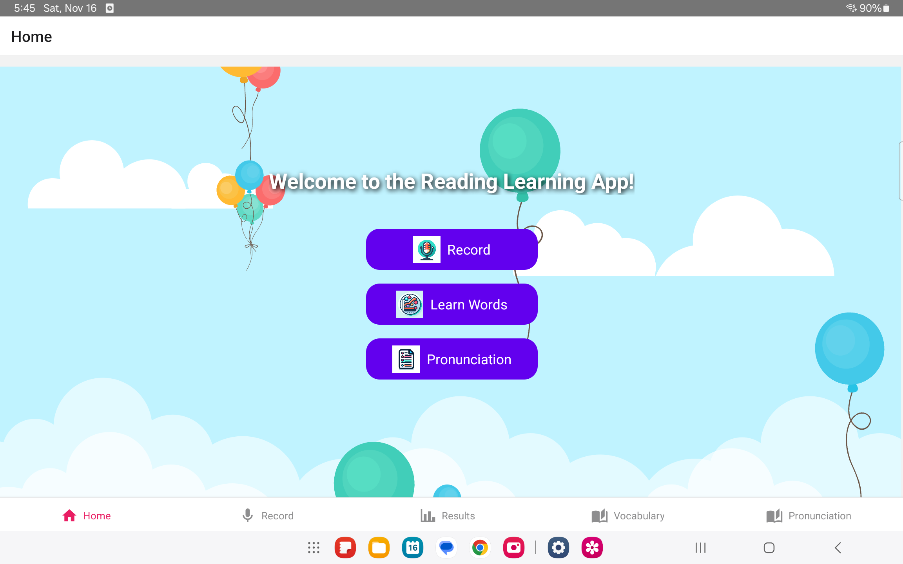
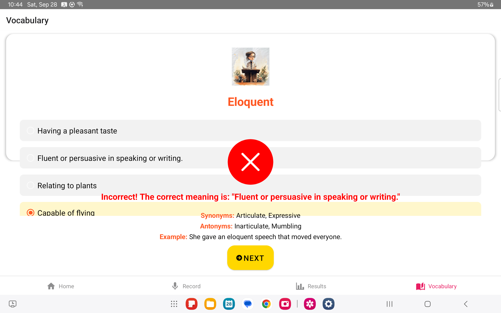
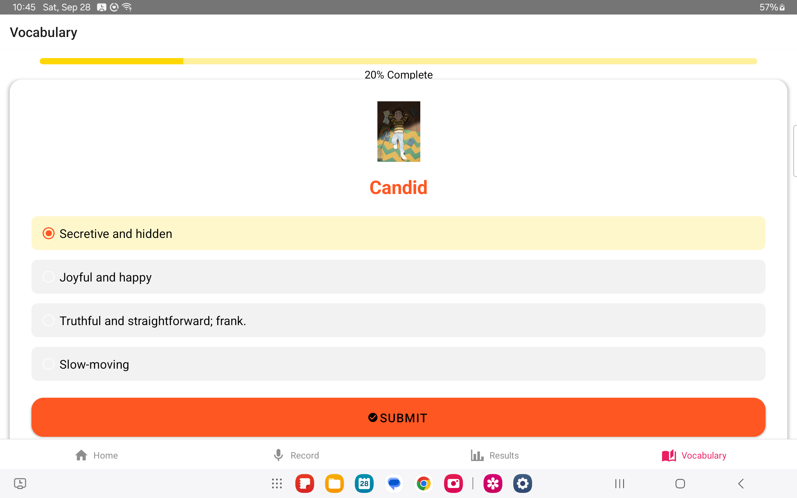
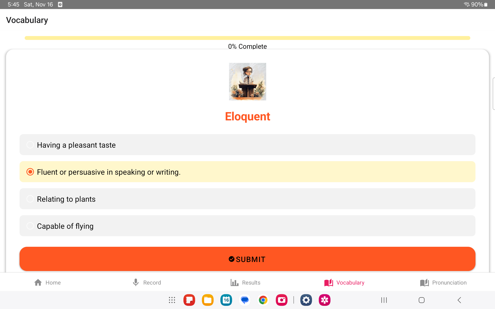
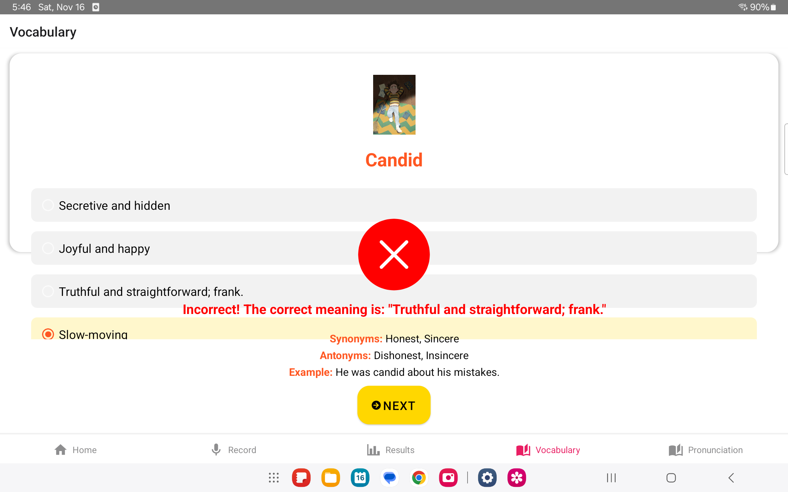
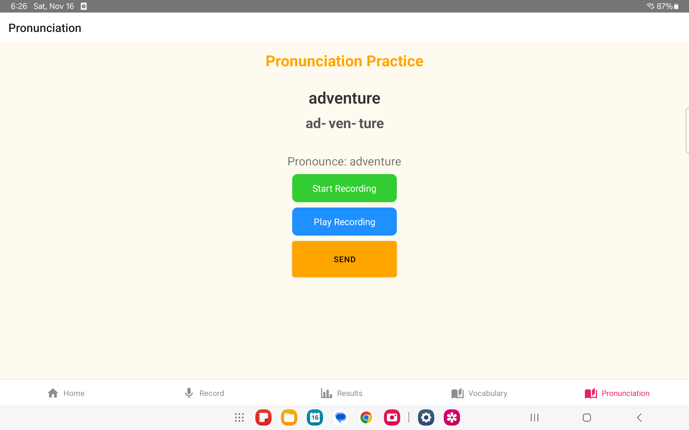
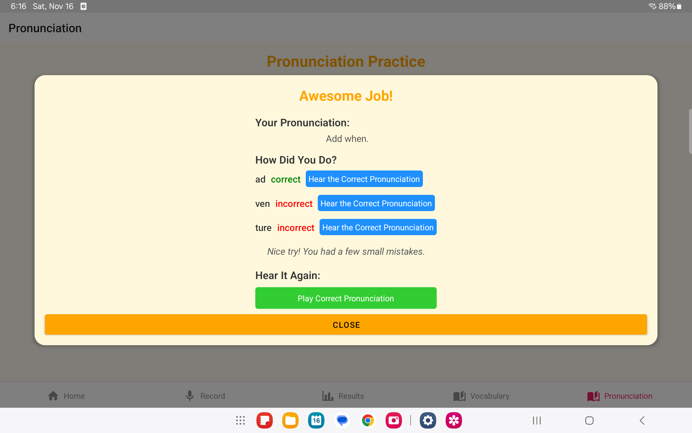
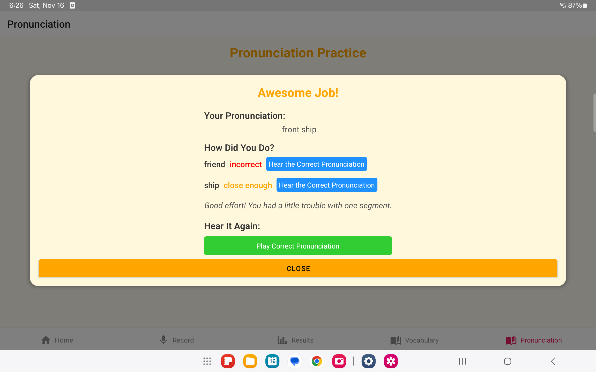
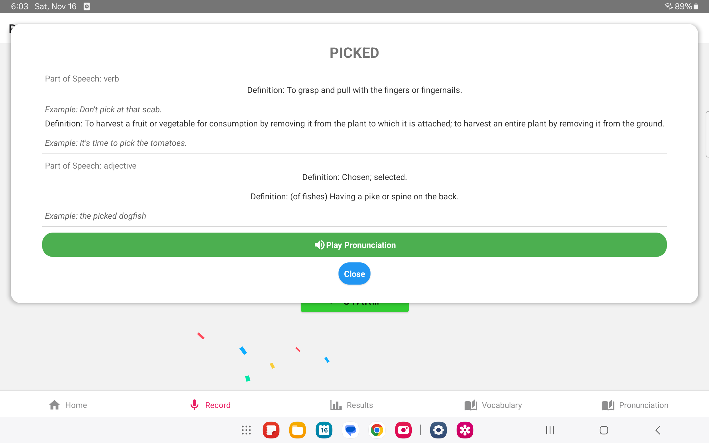

# Reading Companion App (Frontend)

## Overview

The Reading Companion App is the mobile frontend for the Reading Companion System — an interactive learning tool designed to improve vocabulary, pronunciation, and reading comprehension for children aged 6–12. Built with React Native, this cross‑platform application communicates with a backend API to provide real‑time transcription, adaptive vocabulary exercises, and phonetic pronunciation feedback.

---

## Table of Contents

- [Installation](#installation)  
- [Configuration](#configuration)  
- [Running the App](#running-the-app)  
- [UI Overview](#ui-overview)  
  - [Home Screen](#home-screen)  
  - [Vocabulary Assessment](#vocabulary-assessment)  
  - [Progressive Difficulty](#progressive-difficulty)  
  - [Immediate Feedback](#immediate-feedback)  
  - [Phonetic Breakdown](#phonetic-breakdown)  
  - [Phonetic Feedback](#phonetic-feedback)  
  - [Adaptive Pronunciation Practice](#adaptive-pronunciation-practice)  
- [Backend Integration](#backend-integration)  
- [Project Structure](#project-structure)  
- [Contributing](#contributing)  
- [License](#license)  

---

## Installation

```bash
git clone https://github.com/<username>/reading-companion-frontend.git
cd reading-companion-frontend
npm install
```

## Configuration

Create a `.env` file in the project root with:

```env
BACKEND_URL=https://api.yourdomain.com
```

## Running the App

**iOS:**

```bash
npx react-native run-ios
```

**Android:**

```bash
npx react-native run-android
```


## UI Overview

Each section below includes a screenshot (`assets/images/`) and a brief description of its functionality.

---

### Home Screen

  

The **Home** screen provides easy access to main functions:

- **Record:** Quickly record audio for pronunciation practice.
- **Learn Words:** Begin a vocabulary assessment to test and build your knowledge.
- **Pronunciation:** Start interactive phonetic practice sessions.

Navigation tabs at the bottom allow easy switching between **Home**, **Record**, **Results**, **Vocabulary**, and **Pronunciation** screens.

---

### Vocabulary Assessment



The initial vocabulary assessment establishes a user's baseline proficiency through a series of multiple-choice questions. Users select the definition they think is correct, then submit their answers to receive immediate feedback.

---

### Progressive Difficulty



The app dynamically adjusts the vocabulary difficulty based on user performance. Correct answers result in increasingly challenging words, while incorrect responses adjust the difficulty to ensure effective learning.

---

### Immediate Feedback

  


When a user answers incorrectly, the app immediately provides the correct definition along with synonyms, antonyms, and usage examples. This helps reinforce learning through direct feedback and examples.

---

### Phonetic Breakdown



The phonetic breakdown guides pronunciation practice by visually segmenting words into phonetic parts. Users see clear syllable separation and are encouraged to pronounce each segment distinctly.

---

### Phonetic Feedback

  
  


After users record pronunciation, the app highlights segments to indicate accuracy:

- **Green:** Correct pronunciation
- **Yellow:** Close but needs improvement
- **Red:** Incorrect pronunciation

Users have options to replay correct pronunciation segments, making it easy to pinpoint and practice problem areas.

---


### Adaptive Pronunciation Practice

Allows segment-by-segment replay and repeated practice with supportive prompts.

## Backend Integration

The frontend communicates with the backend REST API to send audio recordings and receive analysis results.

| Endpoint       | Method | Request Body                             | Response                                | Description                               |
|----------------|--------|------------------------------------------|-----------------------------------------|-------------------------------------------|
| `/api/audio`   | POST   | `{ audio: <base64 string>, userId? }`    | `{ transcription, metrics, feedback }`  | Upload audio for transcription and feedback |
| `/api/results` | GET    | `?userId=<id>`                            | `{ history: [...results] }`             | Retrieve past session results             |

**Workflow:**

- User taps **Record** → speaks into microphone → audio converted to base64.
- Frontend sends **POST** to `/api/audio`.
- Backend returns JSON containing transcription, word complexity suggestions, readability metrics, and phonetic feedback.
- Frontend displays results on the **Results** screen, showing highlighted errors, metrics, and next-word suggestions.

## Project Structure

```text
/src
├── assets/images        # UI screenshots and icons
├── components           # Reusable UI components
├── navigation           # Tab-based navigation setup
├── screens              # Home, Record, Results screens
├── services             # API request functions
└── utils                # Helper functions (audio encoding, formatters)
```

## Contributing

Contributions welcome! Please fork the repo, create a feature branch, and submit a pull request. Follow existing coding conventions and ensure linting passes.

## License

This project is licensed under the **MIT License** — see [LICENSE](LICENSE) for details.


Contributing

Contributions welcome! Please fork the repo, create a feature branch, and submit a pull request. Follow existing coding conventions and ensure linting passes.
License

This project is licensed under the MIT License — see LICENSE for details.
